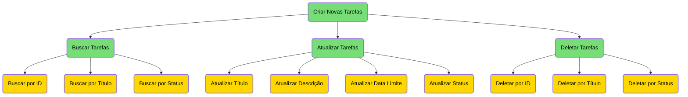

# Desafio de API Spring Boot para Nível Jr

## 1. API de Gerenciamento de Tarefas

Esta é uma API RESTful desenvolvida para gerenciar tarefas. A API permite a criação, atualização, exclusão e busca de tarefas com base em diversos critérios. Utiliza o framework Spring Boot e Spring Data JPA para persistência de dados em um banco de dados.

## Diagrama

### Atributos das Tarefas

Cada tarefa possui os seguintes atributos:

- **ID:** Um identificador único gerado automaticamente para cada tarefa.
- **Título:** O título da tarefa.
- **Descrição:** Uma breve descrição da tarefa.
- **Data de Criação:** A data em que a tarefa foi criada.
- **Data Limite:** A data limite para a conclusão da tarefa.
- **Status:** O status atual da tarefa (pendente, em andamento, concluído).

### Funcionalidades da API

A API oferece as seguintes funcionalidades:

- **Criar Novas Tarefas:** Permite a criação de novas tarefas com título, descrição, data limite e status.
- **Buscar Tarefas:** Oferece a capacidade de buscar tarefas com base no ID, título ou status.
- **Atualizar Tarefas:** Permite a atualização de informações das tarefas, incluindo título, descrição, data limite e status.
- **Deletar Tarefas:** Permite a exclusão de tarefas do sistema.

### Documentação da API

A documentação da API foi implementada utilizando Swagger/OpenAPI para facilitar o entendimento e o consumo dos endpoints disponíveis. Isso proporciona uma visão detalhada dos endpoints, seus parâmetros e respostas esperadas.

---

Este projeto foi desenvolvido como parte de um desafio para nível júnior em API Spring Boot. Esperamos que este README forneça uma visão geral clara do propósito e das funcionalidades da API de Gerenciamento de Tarefas. Se houver dúvidas ou sugestões, sinta-se à vontade para entrar em contato.

